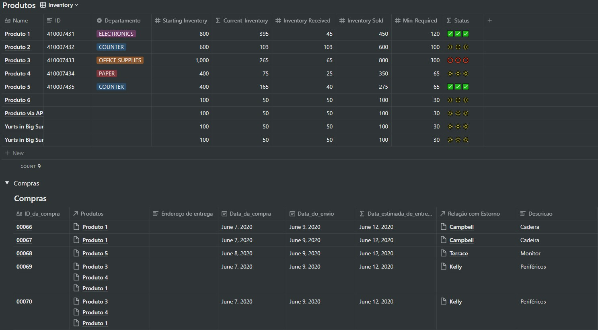

# Notheets 

Integração automática de tabelas e planilhas do Notion para o Google Sheets com envio de email (caso algum produto atinja um nível de estoque em alerta ou entre alguma venda) e tela de controle.

## Estoque

## Email

## Inventory Updates

## Desktop

## Mobile

#### Em desenvolvimento
